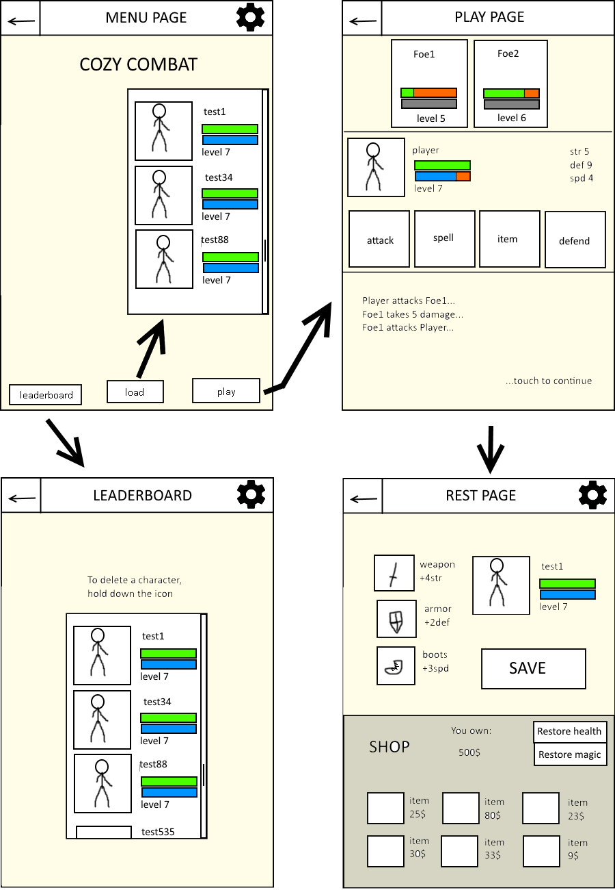

# Design Document - Programmeer Project

Joseph Weel, 10321624, Universiteit van Amsterdam

CasualCombat is an app for a game of turn-based combat.

*Minimum viable product*

The app should be minimally viable if it can handle the most basic mechanics of old
school turn-based combat games. These are:
* Combatants take turns choosing actions to defeat their opponent
* Chosen actions affect the "health points" of whatever was targeted by the action
* When a combatant's "health points" reach zero, they are defeated
* A combatant wins by defeating all opponents

With these underlying mechanics in place, most old school turn-based combat games add:
* Combatants can "level" up by defeating opponents, which gives them access to more actions
* Progress can be saved in-between fights
* Combatants have certain "skill values" that affect their actions

Once the mechanics are in place there are lots of optional features that are found in
these games, including:
* Usable items that can be used in combat as an action
* Gear that can be equipped in-between fights which passively affects the combat
* Items and gear can be bought in shops in-between fights
* There are different types of player characters and opponent characters, each with different strengths and weaknesses

The CasualCombat app should handle all of the first seven points, but may seem somewhat stale
until it also handles the four additional points. However, the app will not have reached
its design goal unless it also features quick combat, which means that
* Individual fights should not have to take long

*Framework*

Now follows an overview of the framework that can achieve the points written above.

These are the most important activities (screens) :

* MenuPage - this is the title screen. A user can start a new game, load an existing game, or check high scores, by clicking buttons on this screen.
* PlayPage - this is the page on which the game takes place. Various buttons handle various actions, and eventually they lead to a rest screen, or the game can be cancelled to return to the menu screen.
* RestPage - this is where a user arrives after finishing combat on the PlayPage, either by winning or losing. If they win they can save their progress, restock their supplies, start a new combat session, or go back to the menu screen.

Some secondary activities :

* LeaderboardPage - this is where a user can see how many fights of all the saved characters have won, which is essentially their "score". Users can return to the menu screen from this screen. They can also delete characters.
* InformationPage - this screen can be accessed from other screens and displays information about every usable action in combat.

Apart from these activities, there are other classes :

* Combatant - abstract. Various return methods that return values that belong to a combatant, such as their "skill values" and their name.
* Foe - extends Combatant. These are the opponents of the player character. There will be several templates of foes (types of foes), each with different skill values and usable actions.
* PlayerCharacter - extends Combatant. This is the character that is controlled by the user. Like the Foe, it will have a collection of usable actions, but it will also have usable items and gear. There may also be templates for various PlayerCharacters.
* Move - this is an action that a Combatant uses. It affects the skill values of other Combatants (usually the "health points")
* Item - this is either a usable item in combat (which means it is linked to a certain Move), or an item which increases the skill values of a PlayerCharacter for as long as they have equipped it in-between fights.
* Game - this class handles the state of the game. It keeps track of the "health points" of all combatants, and handles their actions one by one (turn-based). It also contains a LinkedList<String> which is a Log of events that happened during combat. These are accessed by the interface in PlayPage and displayed.

The app works by having a user choose a character and then clicking a Play button. This takes
them to the PlayPage where a Game object is created that creates a PlayerCharacter object for the user
and Foe objects for the opponents. It then waits for input from the user (who can press buttons that 
correspond to various actions at this time), and then handles what happens to the foes and the player character
as a result of these actions. For example, if there is an action where a PlayerCharacter attacks a Foe, it will check
the skill values of both, and the Item objects that are linked to the PlayerCharacter, and calculates how much "damage"
is dealt to the Foe (how many health points can be subtracted). It sends a report of what happens to the Log, which is a TextView at the bottom of the PlayPage,
which must be touched in order to head to further messages. Once there are no more new messages, the user
can press one of the buttons again, assuming their character has not died (health points == 0). If the player character or all foes
have died, then, once all messages in the log have been traversed, the Game prepares the next Activity.

On the RestPage a user can click on buttons to restore their health at the cost of "money", which they earn at the
end of combat (should they win). They can also buy items or gear with other buttons. There is also a button where a user
can save their progress, which sends data to the SharedPreferences. They can then start a new fight, which sends the user to
another PlayPage with a new Game object, or exit, returning to the MenuPage.

Alternatively, should the player character have been defeated, the user is shown a screen of their defeat, and they can try again,
which recreates the Game object and PlayPage, or return to the MenuPage.

Actions that Combatants can perform are Move objects that are stored in ArrayLists. Combatants
can choose from their ArrayList what Move to use, but if they require "magic points" and they do not have
enough, then they cannot use that Move. The user will have a scrollable ListView with every item corresponding
to a usable Move. The user gets a similar ListView for their usable items.

Templates for Foe instances can be saved as constant int arrays, with each index of the array
corresponding to a certain skill value. The ArrayList of Moves can be added using an easily
modifiable switch case in some initialization method. The default templates of PlayerCharacters
will work similarly.

When a user wants to start a new game with a new player character, then they will get a popup window
where they can enter a name. Perhaps a user can use an image on their phone as an icon in
a ImageView next to the player character.

Another look at the separation of interface and data provider in PlayPage activity:
* Once a user has picked a move for their player character, the game will generate moves for all
Foe objects (pseudo-random or basic AI). It will then put all Combatants into a list that is sorted
by their "speed" values, and will then handle each Combatant's move, with the Combatants with
higher speed going first. The target of an action is stored in the Move object, as well as what
values of the target are affected (usually health). At this point a message is sent to a Log, which
can be picked up by the PlayPage interface. The Game object continues and checks if the Combatant has
been defeated (zero health points left), which can prompt another message to the Log. After this check the
remaining Combatants' Moves are handled. Once all Combatants have had a Move, a "turn" ends, and the
user can select a new action (if they haven't died). Getting new information on the display in the PlayPage
interface (by "popping" it from the Game LinkedList log) as well as picking actions are done via touching various Views.

A look at the interface (arbitrary background colours):

