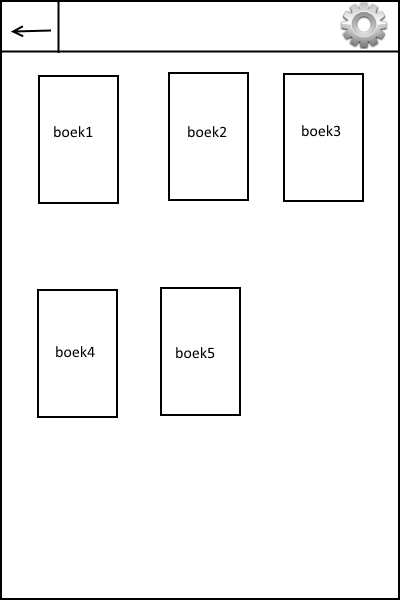
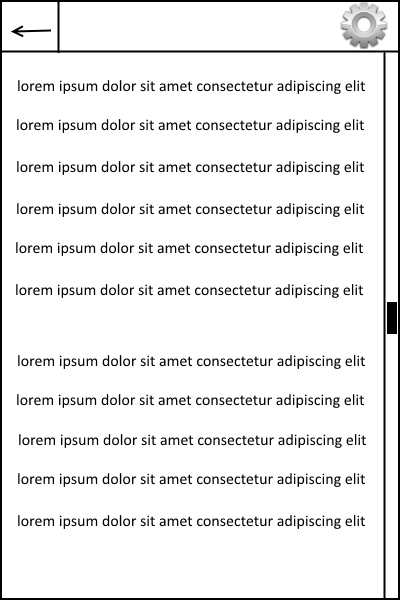

# Programmeer Project

The goal of this project is to create an app that can read and display epub files.

*App still needs a name.*

This will be an eReading app. The original inspiration for this came when noticing
most epub reading apps for Android are not very fast, meaning the original goal
was to make an app that can quickly load these files and display them for eReading.
However, even if the quickload aspect is not attainable, there are still some other
features that can be built in the app. Now follows a list of potential features:
* Quickly load and display *epub* files
* One scrolling page that contains the entire text
* Position within scrolling page is stored between sessions
* Changeable background and text color, and changeable font
* Setting bookmarks to quickly scroll back to
* Keep track of reading time per book
* Give scores to read books
* (Possible) Statistics page to see reading time per book

Setting bookmarks and changing font, although minor, are features I have not
seen in other eRead apps.

Some extremely basic sketches:

 

Required data sets and data sources:
* Source is the epub file (supplied by the user). Dataset could be one very large string?
* Alternative is lots of strings, one for each paragraphs ("text block"). In htm book files
	such paragraphs	are readily defined, but for this app it will depends on how epub works
* Reading time (if implemented) can be stored locally with SharedPreferences
* Progress within book, perhaps using (position of scrollview / total scrollview length)
* Book rating, if multiple usages per book (time, rating, progress), some kind of
	id system may be necessary in order to keep track of all these.

Decomposition:
* Menu, from which books can be chosen. Button to change settings
* Reading page (read the epub file, scroll down and up, may also go to settings from here?)
* Possible statistics page
* The reading page can be further decomposed into parsing the epub and displaying the content

Platform and components:
* The touch controls of mobile device will allow a user to scroll as they read
* If Android has trouble with handling very large strings, some external library may exist
	to help optimize it or parse it in some other way
* The idea of eReading is to read on mobile devices. Since the platform is a mobile
	device, the platform itself being a mobile device is already half of this goal.

Problems, or some things I will have to learn before being able to implement all features:
* How do epub files work, how can their content be viewed and processed
* How to scroll and operate very large content (very large strings?). If this becomes
	too much of a problem I could always divide one large string into multiple smaller strings.
* Some book files have fonts defined within paragraphs, how to dynamically alter
	this without it costing too much memory
* If fast loading is easy, then why is it not in all eRead apps? Maybe it is not as attainable
	as I hope. If fast loading is too difficult or impossible, that is unfortunate, but
	I will still have other features to work towards.

A similar app:
* s2reader - This app shows a simple menu that shows percentage progress into books in 
	a folder that the user supplied. Touching a book takes the user to the read page,
	but the loading of the book takes very long. The book is organized into chapters,
	and every chapter goes through this loading. The reading is all done by scrolling.
	Progress is stored, but the app is not closed when putting the phone to sleep, which
	causes phone power to go down very fast. However, since it is not auto-closed, turning the
	phone back on will allow a user to go back to reading immediately (no loading required here).