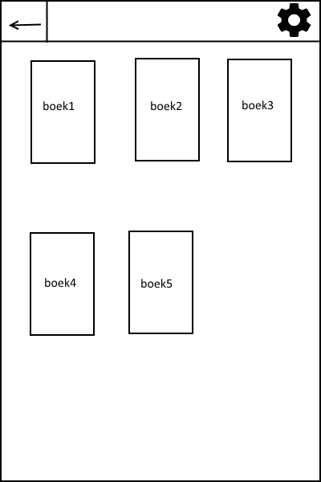
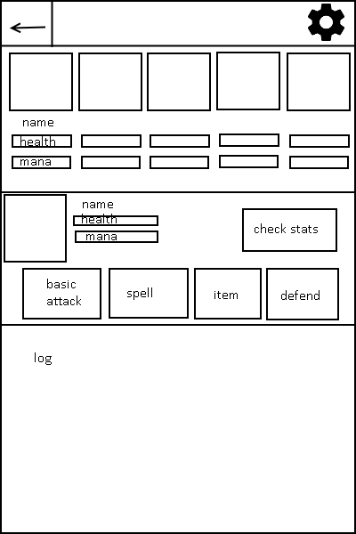

# Programmeer Project

Joseph Weel, 10321624, Universiteit van Amsterdam

The goal of this project is to create an app for a turn based combat game.

Casual Combat

This will be a game app. Inspired by old school RPG games where a protagonist
has to fight foes in order to progress their story, the turn based combat of these
games can be a standalone game, and hopefully a very entertaining one. A user would use
this app to quickly pass time when they are bored.
Here is a list of potential features:
* Different skills that depend on certain skill values
* Enemies are controlled by the computer
* Individual fights can be short
* Save progress in-between fights

The design goal of this app is for everything to be quick and simple (hence "Casual").
Combat should not have to take very long, and can be gotten into very easily and quickly.

I have not seen an app with standalone turn based rpg combat, so this will be a new
experience for users.

Some extremely basic sketches:

 

Required data sets and data sources:
* A character with skill values, stored in some character object
* Enemies with their own skill values
* Storage of the character for save/load
* A possible class for items

Decomposition:
* Menu, from which a new game can be started or an existing one loaded
* Play page, from which the game can be played
* Information page, to display information about skills and attacks
* Score page, to keep track of how many fights saved characters have won
* Shop page, between fights a character can restock here

Platform and components:
* Touch support for buttons that can be used to pick attacks and traverse menus
* This app is meant as a quick and easy way to pass time, and that works great on
	mobile devices because it can then be done anywhere.

Problems, or some things I will have to learn before being able to implement all features:
* How to deal with different spells and allowing access to only some

A similar app:
* Any emulator that runs old school rpg games?