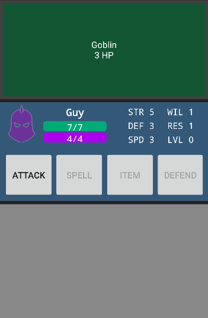

# Programmeer Project

Joseph Weel, 10321624, Universiteit van Amsterdam

# Casual Combat

An app for a turn based combat game.

In this game, the player fights turn-based battles, becoming more powerful after each battle. After a battle, gold and level up points are earned, and the player is taken to a shop. Here, gold can be used to buy items, equipment and spells, and level up points can used to improve the player character's skills. They then continue to the next battle.
 

The app uses the ComplexPreferences library found here:
 <href >https://github.com/fsilvestremorais/android-complex-preferences</href>
It is licensed under the Apache License, Version 2.0 (the "License")

License
-----

    This app belongs to me. Please don't steal it.